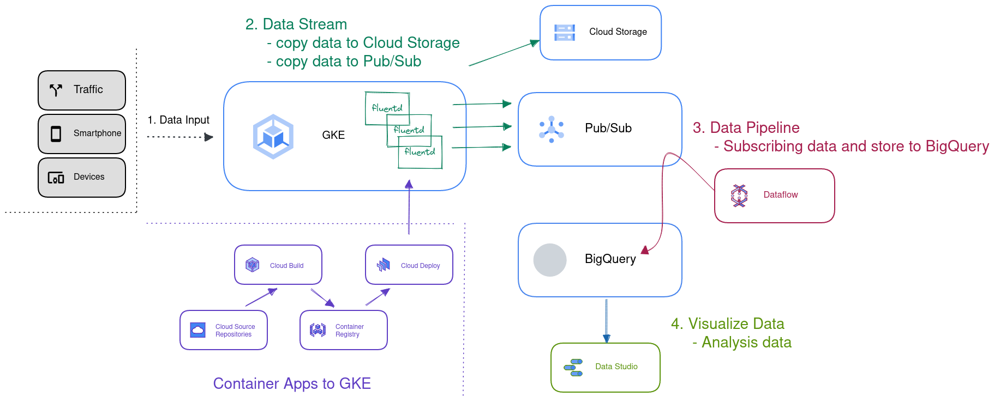
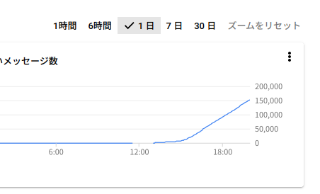

# mqtt_data_pipelines
## 目的
- MQTTクライアントを想定したデータパイプライン実装検討/実証
- InjestからStoreまでを集中的に検討し、DataStudioやLooker等による可視化部分は未実装
## 結果
### 全体概要
- 本構成のうち、1,2,3を実装

### データハブ(中継)
- 入力に対してデータロス無く、安定したデータ中継を実装

### データ入力
- Gateway機能のコア部分を[Docker化](https://github.com/EndlessPancake/mqtt_data_pipelines/tree/gateway_0811/Gateway)
### データパイプライン
- pub/subからBigQueryへ

## 各種コスト
### Gateway内容、成果物
- Fluent + plugin構成設計、実装に2人日
- 上記実装テストに0.5人日
### GCP各種費用
- 600[円/day]
  - ただし、本検証データ量(20万件、3GB)に限り 

## 実装概要補足
- 模擬データに2014年Uber提供のPublicデータを利用
```
|MQTT Clinent模擬データ| --> [GKE(Data Injest and route)] --> [cloud pub/sub] <-- [cloud dataflow] --> [Google BigQuery]
```
### データ入力(Endpoint)
  - "MQTT gateway"としてInternetからの入り口をFluentを使用し、Docker Image化
    - IN(plugin: MQTT) - FILTER(plugin: typecast) - OUT(plugin: Pub/Sub)
  - 上記をGKEへ展開し、Gateway機能とする
    - Ingress(GCP LB)
    - Deployment(replicaset)で水平展開が可能 
    - GCP IoT Core の様なPublic Cloud特殊構成は避ける 
### データハブ(中継)
  - GCP pub/sub を採用する
  - Dataflowとの連携を考慮
### データパイプライン
  - cloud dataflow(Apache Airflow)
  - *cloud functions (Streamデータを想定したため、不採用)*
### メタデータストア
  - bigquery を採用
